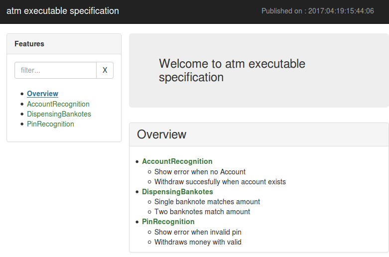
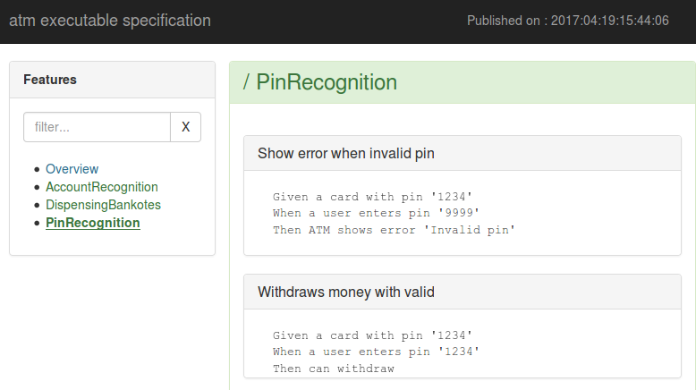

# gherkin-htmlify

Generate html pages from your feature files and share them easier.

## examples of generated pages

- Overview:

- Feature:

## how to run gherkin-htmlify

  Create a file named runner.js with content like:

    var gherkinHtmlify = require('./gherkin-htmlify');
    var featureDirectoryPath = '<your feature file folder>';
    var outputDirectory = '<where to put the html files>';
    var options = {
      mainTitle: "<title to use>"
    };                                                                     
    gherkinHtmlify.process(featureDirectoryPath, outputDirectory, options);
  
  Now, checkout the gherkin-htmlify project to generate html pages
  
    git clone https://github.com/sboursault/gherkin-htmlify.git
    npm install file ncp
    node runner.js

   

    
   